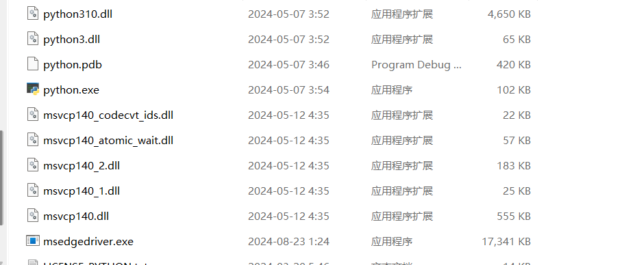
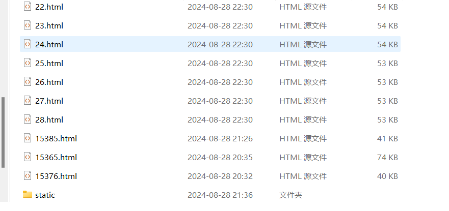
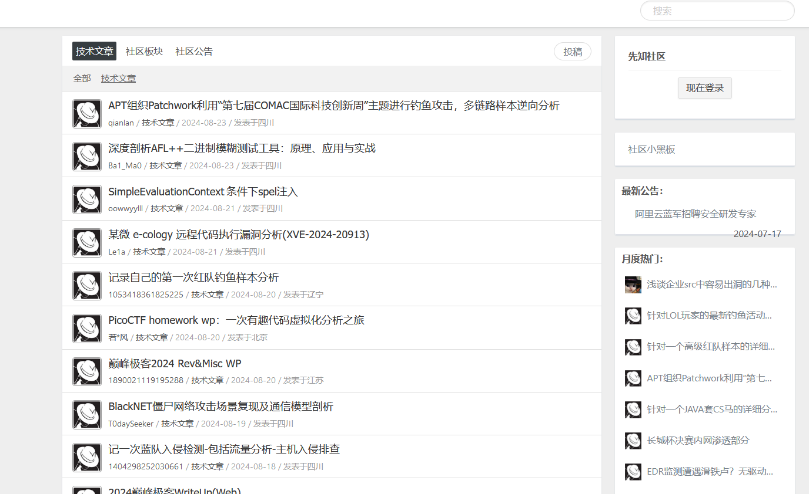
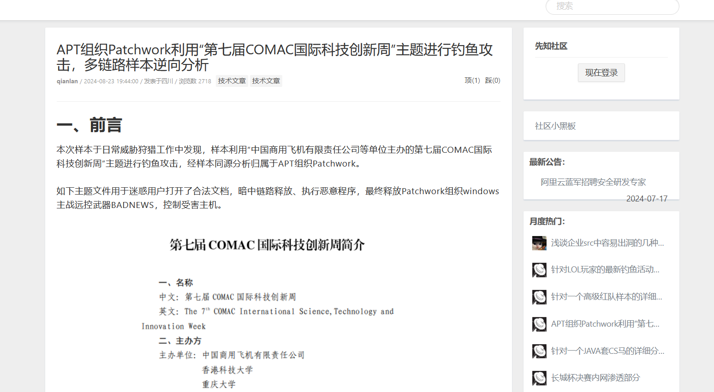

## 准备

安装python库

```
	pip install selenium
	pip install fake_useragent
```

下载对应浏览器驱动至python.exe目录  
[驱动下载地址](https://developer.microsoft.com/zh-cn/microsoft-edge/tools/webdriver/?form=MA13LH#downloads)



## 运行

打开`main.py`,选择想要执行的操作  

```python
#获取主页面源码，第一次必须执行
#get_topic()


#获取文章源码
#pages=[1,2,3]  #自行选择页数
#begin(pages)


#生成已获取的页面
#spiderALL() #默认会下载图片

#如果不下载图片请使用：
#spiderALL(False)

#生成单个文章页面
#选择生成的文章标识，例如'https://xz.aliyun.com/t/14645'
#num=14645   
#spiderSingle()
```

运行`main.py`

```
	生成结果在output
	文件结构不能动,output里面是一个整体
```

## 注意访问频率，一般访问几十次就会要求人机验证

## 展示效果






